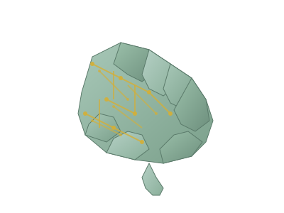
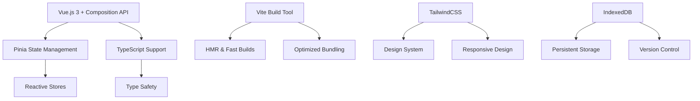
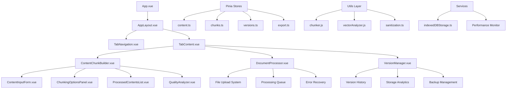

# 🚀 Doc Layer - Enterprise AI Document Processing Platform

A professional desktop and web application for creating, processing, and managing AI-ready knowledge bases with advanced document processing capabilities, comprehensive version control, and enterprise-grade desktop experience.



## 🖥️ Desktop Application Features

### **Professional Desktop Experience**
Doc Layer now includes a fully-featured **Electron desktop application** with native OS integration:

- **Native Desktop App**: Professional standalone application for Windows, macOS, and Linux
- **Custom Title Bar**: Sleek, integrated title bar with window controls
- **Desktop-Optimized UI**: Norton-style professional interface with glass-morphism effects
- **Horizontal Step Navigation**: No vertical scrolling - smooth horizontal transitions between workflow steps
- **Professional Sidebar**: Dark-themed navigation with quick access to all features
- **Native File System**: Direct integration with OS file dialogs and drag-and-drop
- **Keyboard Shortcuts**: Professional keyboard shortcuts for power users
- **Auto-Updates**: Built-in update system for seamless version management

### **Desktop Installation**
```bash
# Quick Start Desktop App
npm run electron:dev          # Development mode with hot reload
npm run electron:build        # Build for production
npm run electron:preview      # Preview built app

# Create Desktop Installers
npm run dist:win             # Windows installer (.exe)
npm run dist:mac             # macOS installer (.dmg)
npm run type-check            # TypeScript validation
```

### **Deployment**
The application builds to static files that can be deployed to any web server:
- Upload `/dist/` folder to your web server
- Compatible with GitHub Pages, Netlify, Vercel, AWS S3, etc.
- No server-side requirements - pure client-side application

## 📱 Application Overview

Doc Layer features three main tabs, each designed for specific content processing workflows:

### 🏗️ **Tab 1: Manual Content Builder**
Transform raw text into AI-ready knowledge chunks through a guided 3-step process:
- **Manual Content Input**: Create content chunks from scratch using a source/title and content form
- **Intelligent Chunking**: Multiple chunking strategies (word-based, character-based, section-based)
- **Real-time Statistics**: Live word counts, character counts, and estimated chunk metrics  
- **Chunking Configuration**: Customizable chunk size, overlap settings, and auto-tagging options
- **Content Processing**: Transform raw content into optimized AI-ready chunks
- **Chunk Review & Editing**: Review, edit, and refine generated chunks before export
- **Auto-save System**: Automatic backup with IndexedDB persistence

### 📄 **Tab 2: Document Processing** 
Batch process multiple documents with advanced file handling:
- **Multi-Document Upload**: Process up to 20 files simultaneously (.md, .pdf)
- **Enhanced File Queue**: Individual file status tracking with real-time progress
- **Intelligent Processing**: AI-optimized content extraction and chunking
- **Error Recovery**: Retry failed files with detailed error reporting
- **Memory Management**: Handles large file batches without browser crashes
- **Desktop Mode**: Horizontal step navigation with no vertical scrolling
- **Step-by-Step Workflow**: Upload → Configure → Process → Review → Export
- **Full-Screen Panels**: Each step utilizes entire screen real estate

### 🗄️ **Tab 3: Version Control**
Comprehensive history and backup management:
- **Version History**: Complete timeline of all saved content states
- **Auto-save on Export**: Automatic version creation during export operations
- **Manual Snapshots**: User-initiated version creation with custom names
- **Data Restoration**: Restore any previous state with full data integrity
- **Export Tracking**: Download previous exports or create new ones from any version
- **Storage Analytics**: Monitor usage, performance, and storage statistics

## ✨ Advanced Features

### 🎨 **Professional Design System**
- **Modern UI/UX**: Clean, intuitive interface with smooth animations
- **Responsive Design**: Optimized for desktop, tablet, and mobile devices
- **Accessibility**: Full keyboard navigation, screen reader support, ARIA compliance
- **Brand Identity**: Ragara brand with sage green (#A8B79D) and gold (#D4AF37) color system
- **Desktop Glass-Morphism**: Professional frosted glass effects in desktop mode
- **Norton-Style Layout**: Enterprise-grade desktop interface inspired by professional security software
- **Semantic Color System**: WCAG-compliant color palette for optimal readability
- **Component Library**: Reusable UI components with design tokens

### 🚀 **Export Capabilities**
- **Azure Vector Store**: Optimized JSON format for Azure OpenAI vector store ingestion
- **Multiple AI Formats**: OpenAI, LangChain, Pinecone, ChromaDB, Hugging Face compatibility
- **Traditional Formats**: JSON, CSV, TXT, XML, Markdown export options
- **Upload Scripts**: Auto-generated upload scripts for each platform
- **Structured Metadata**: Content + metadata with source, chunk_id, tags, and word_count
- **Batch Export**: Export entire knowledge bases or selected chunks

## 🚀 Quick Start

### Prerequisites
```bash
Node.js v18+ (recommended)
npm or yarn package manager
```

### Installation

1. **Clone the repository**
   ```bash
   git clone <repository-url>
   cd peppercorn-kb-builder
   ```

2. **Install dependencies**
   ```bash
   npm install
   ```

3. **Start development server**
   ```bash
   npm run dev
   ```

4. **Open in browser**
   - Navigate to `http://localhost:3000`
   - The app will auto-reload when you make changes

### Production Build

```bash
# Build for production
npm run build

# Preview production build
npm run preview

# Type checking
npm run type-check
```

## 📋 Usage Guide

### 🏗️ Builder Tab - Manual Content Creation

#### Creating Content
1. **Enter Source/Title**: Provide a descriptive source or title for your content
2. **Input Content**: Paste or type your complete content into the textarea
3. **Configure Chunking**: Choose chunk size (200-1000 words), overlap percentage, and auto-tagging
4. **Process Content**: Transform your content into AI-ready chunks automatically
5. **Review & Edit**: Examine generated chunks, edit content, and refine as needed
6. **Export**: Download your processed chunks in various formats (JSON, CSV, TXT, XML, Markdown)

#### Step-by-Step Workflow
- **Step 1 - Create**: Input your content and configure chunking settings
- **Step 2 - Review**: Examine generated chunks, search/filter, and make edits
- **Step 3 - Export**: Download your processed content in your preferred format

#### Advanced Features
- **Real-time Statistics**: See word count, character count, and estimated chunks as you type
- **Multiple Chunking Strategies**: Word-based (recommended), character-based, or section-based
- **Auto-tagging**: AI generates relevant tags for better content organization
- **Search & Filter**: Find specific chunks quickly with built-in search functionality

### 📄 Documents Tab - AI Document Processing

#### File Upload & Processing
1. **Multi-File Upload**: Drag & drop up to 20 documents
   - Supported formats: `.md`, `.markdown`, `.pdf`
   - File size limits: 50MB per PDF, 10MB per markdown
   - Total batch limit: 200MB

2. **Configure Processing**:
   - **Chunk Size**: 200-1000 words (recommended: 300-800)
   - **Overlap**: 0-30% of chunk size (prevents information loss)
   - **Auto-tags**: Enable AI-powered tag generation

3. **Monitor Progress**:
   - **File Queue**: Individual status for each file
   - **Real-time Updates**: Processing progress with time estimates
   - **Error Handling**: Detailed error messages with retry options

#### Enhanced Queue Management
- **Visual Status Indicators**: Queued → Processing → Completed/Failed
- **Individual Progress Bars**: Per-file processing percentage
- **Retry Mechanism**: One-click retry for failed files
- **Remove Options**: Clean up queue by removing problematic files
- **Processing Statistics**: Time estimates, rates, and completion metrics

### 🗄️ Versions Tab - Version Control

#### Version Management
- **Auto-save System**: Versions created automatically during exports
- **Manual Saves**: Create snapshots with custom names at any time
- **Complete History**: Browse all versions with metadata
- **Quick Restore**: Load any previous state instantly
- **Export Tracking**: Download previous exports or create new ones

#### Storage Features
- **IndexedDB Persistence**: Reliable browser-based storage
- **Data Migration**: Automatic migration between storage systems
- **Cleanup Tools**: Remove old versions to manage space
- **Backup Integration**: Export versions for external backup

## 🔧 Configuration Options

### Chunking Strategies

#### Word-based Chunking (Recommended)
```javascript
{
  chunkBy: 'words',
  chunkSize: 500,    // 300-800 words optimal
  overlap: 50,       // 10-20% recommended
  autoTag: true
}
```

#### Character-based Chunking
```javascript
{
  chunkBy: 'characters',
  chunkSize: 2000,   // 1500-3000 characters
  overlap: 200,      // 10-15% recommended
  autoTag: true
}
```

#### Section-based Chunking
```javascript
{
  chunkBy: 'sections', // Uses markdown headers
  autoTag: true        // Size determined by content structure
}
```

### Export Formats

- **JSON**: Structured data for AI training
- **CSV**: Spreadsheet-compatible format
- **TXT**: Plain text with optional separators
- **XML**: Structured markup format
- **Markdown**: Formatted text with metadata

## 🛠️ Technical Architecture

### Core Technology Stack


### Frontend Technologies
- **Framework**: Vue.js 3.4.0 with Composition API
- **Desktop Framework**: Electron 37.2.6 for native desktop applications
- **State Management**: Pinia 2.1.7 with TypeScript stores
- **Styling**: TailwindCSS 3.4.17 with custom design tokens
- **Build System**: Vite 4.5.0 with hot module replacement
- **Desktop Builder**: electron-builder 26.0.12 for cross-platform packaging
- **Routing**: Vue Router 4.5.1 for SPA navigation
- **TypeScript**: Full TypeScript 5.0+ support with type checking
- **Icons**: FontAwesome 6.5.0 with optimized icon loading

### Document Processing Stack
- **PDF Engine**: PDF.js 2.16.105 with web worker support
- **Markdown Parser**: Marked.js 12.0.0 with custom renderer extensions
- **Text Processing**: Custom chunking algorithms with overlap management
- **File Operations**: File-saver 2.0.5 for client-side downloads
- **Drag & Drop**: Vue-draggable-next 2.2.1 for interactive reordering

### Storage & Performance
- **Primary Storage**: IndexedDB with automatic migration
- **Fallback Storage**: LocalStorage for compatibility
- **Virtual Scrolling**: Custom implementation for large datasets
- **Memory Management**: Automatic cleanup and garbage collection
- **Performance Monitoring**: Built-in performance optimization utilities

### Specialized Components & Utils
- **Vector Analysis**: Enhanced vector readiness scoring system
- **Quality Analyzer**: Content quality assessment with actionable feedback  
- **Virtual Scroll**: High-performance rendering for 1000+ items
- **Error Boundaries**: Comprehensive error handling with recovery
- **Keyboard Navigation**: Full keyboard accessibility support
- **Performance Optimizer**: Automatic performance monitoring and optimization

### Component Architecture Flow


### AI-Powered Sub-Agents & Analysis Tools
The application includes several AI-enhanced components that provide intelligent content analysis:

#### 🧠 **Vector Readiness Analyzer**
- **Purpose**: Evaluates content chunks for optimal AI/ML vector database ingestion
- **Features**: 
  - Semantic coherence scoring
  - Optimal chunk size analysis  
  - Content density evaluation
  - Similarity overlap detection
- **Output**: Actionable recommendations for improving vector search performance

#### 📊 **Quality Assessment Engine** 
- **Purpose**: Comprehensive content quality analysis and improvement suggestions
- **Features**:
  - Readability scoring (Flesch-Kincaid, SMOG, ARI)
  - Information density analysis
  - Structural consistency checks
  - Metadata completeness validation
- **Output**: Detailed quality reports with specific improvement recommendations

#### 🔍 **Content Categorization System**
- **Purpose**: Automatic content classification and tagging
- **Features**:
  - Topic modeling and classification
  - Auto-tag generation based on content analysis
  - Hierarchical category assignment
  - Domain-specific terminology extraction
- **Output**: Structured metadata tags for improved searchability

#### 🚀 **Performance Optimization Agent**
- **Purpose**: Real-time performance monitoring and optimization
- **Features**:
  - Memory usage tracking
  - Processing speed optimization
  - UI responsiveness monitoring
  - Automatic garbage collection
- **Output**: Performance metrics and automatic optimizations

### Desktop Application Architecture
```
electron/                         # Electron desktop application
├── main.ts                      # Main process entry point
├── preload.ts                   # Preload script for IPC
├── updater.ts                   # Auto-update functionality
└── build/                       # Build assets and icons
    ├── icon.ico                 # Windows icon
    ├── icon.icns                # macOS icon
    └── icons/                   # Linux icons

src/components/                   # Vue components
├── desktop/                     # Desktop-specific components
│   ├── DesktopLayout.vue       # Main desktop layout
│   ├── DesktopSidebar.vue      # Dark-themed navigation
│   ├── CustomTitleBar.vue      # Custom window controls
│   └── DesktopHome.vue         # Desktop dashboard
├── DocumentProcessorDesktop.vue # Horizontal step navigation
└── ...                          # Other components
```

### Project Architecture
```
src/
├── components/                    # Vue components library
│   ├── layout/                   # Core layout system
│   │   ├── AppLayout.vue         # Main application shell
│   │   ├── BaseModal.vue         # Modal dialog base
│   │   ├── TabNavigation.vue     # Tab navigation system
│   │   └── TabContent.vue        # Tab content wrapper
│   ├── content-builder/          # Manual content creation
│   │   ├── ChunkingOptionsPanel.vue    # Chunking configuration
│   │   ├── ContentInputForm.vue        # Content input interface
│   │   ├── ContentStatsDisplay.vue     # Real-time statistics
│   │   ├── ProcessedContentsList.vue   # Chunk list display
│   │   └── StepProgressIndicator.vue   # Multi-step progress
│   ├── modals/                   # Dialog components
│   │   └── SaveVersionModal.vue  # Version saving interface
│   ├── ui/                       # Reusable UI components
│   │   ├── AccordionSection.vue  # Collapsible sections
│   │   ├── ConfirmationDialog.vue # Confirmation dialogs
│   │   ├── FormField.vue         # Form input wrapper
│   │   └── LoadingSkeleton.vue   # Loading placeholders
│   ├── performance/              # Performance-optimized components
│   │   ├── LazyComponent.vue     # Lazy-loaded wrapper
│   │   └── VirtualScroll.vue     # Virtual scrolling list
│   ├── pages/                    # Full-page components
│   │   ├── AccessibilityStatement.vue
│   │   ├── HelpDocumentation.vue
│   │   └── PrivacyPolicy.vue
│   ├── ContentChunkBuilder.vue   # Main content builder
│   ├── DocumentProcessor.vue     # Batch document processor
│   ├── VersionManager.vue        # Version control interface
│   ├── QualityAnalyzer.vue       # Content quality assessment
│   ├── DetailedVectorAnalysis.vue # Vector readiness analysis
│   ├── VectorStoreExporter.vue   # AI platform export
│   ├── BulkOperations.vue        # Bulk chunk operations
│   └── ErrorBoundary.vue         # Error handling wrapper
├── stores/                       # Pinia state management
│   ├── app.ts                   # Global application state
│   ├── content.ts               # Content management store
│   ├── chunks.ts                # Chunk data management
│   ├── export.ts                # Export functionality
│   ├── versions.ts              # Version control store
│   ├── categories.ts            # Content categorization
│   ├── processing.ts            # Document processing state
│   └── persistence.ts           # Data persistence layer
├── composables/                 # Vue composition functions
│   ├── useErrorHandler.ts       # Global error handling
│   ├── useKeyboardShortcuts.ts  # Keyboard navigation
│   ├── useNotifications.ts      # Toast notification system
│   ├── usePerformanceOptimization.ts # Performance monitoring
│   └── useVirtualScroll.ts      # Virtual scrolling logic
├── utils/                       # Utility libraries
│   ├── chunker.js              # Advanced text chunking
│   ├── markdownParser.js       # Markdown processing
│   ├── pdfParser.js            # PDF text extraction
│   ├── enhancedVectorAnalyzer.js # Vector readiness scoring
│   ├── performanceOptimizer.ts # Performance utilities
│   ├── sanitization.ts         # Input sanitization
│   ├── colorOptimization.js    # Color accessibility
│   └── iconOptimization.js     # Icon loading optimization
├── services/                    # External service integrations
│   └── indexedDBStorage.ts     # IndexedDB abstraction layer
├── styles/                      # Design system & CSS
│   ├── design-tokens.css       # Core design tokens
│   ├── design-system.css       # Component design system
│   ├── components.css          # Component-specific styles
│   ├── typography.css          # Text & font styles
│   ├── animations.css          # UI animations
│   ├── mobile-optimizations.css # Mobile-specific styles
│   └── color-contrast-fixes.css # Accessibility fixes
├── types/                       # TypeScript type definitions
│   └── index.ts               # Shared interfaces & types
├── router/                      # Vue Router configuration
│   └── index.js              # Route definitions
└── views/                       # Page-level views
    └── HomeView.vue           # Main application view
```

### Design System

#### Color Palette
```css
/* Primary Brand Colors */
--brand-sage: #A8B79D          /* Primary sage green */
--brand-sage-dark: #8CA085     /* Darker sage variant */
--brand-sage-light: #F5F7F4    /* Light sage background */
--brand-gold: #D4AF37          /* Accent gold */
--brand-gold-soft: #F5E8B8     /* Soft gold background */

/* Semantic Colors */
--color-success-600: #059669   /* Success states */
--color-warning-600: #D97706   /* Warning states */
--color-error-600: #DC2626     /* Error states */
--color-info-600: #2563EB      /* Information states */

/* Neutral Grays */
--neutral-50: #F9FAFB          /* Lightest gray */
--neutral-100: #F3F4F6         /* Light gray */
--neutral-200: #E5E7EB         /* Medium light gray */
--neutral-500: #6B7280         /* Medium gray */
--neutral-700: #374151         /* Dark gray */
--neutral-900: #111827         /* Darkest gray */
```

#### Typography Scale
```css
--font-size-xs: 0.75rem        /* 12px */
--font-size-sm: 0.875rem       /* 14px */
--font-size-base: 1rem         /* 16px */
--font-size-lg: 1.125rem       /* 18px */
--font-size-xl: 1.25rem        /* 20px */
--font-size-2xl: 1.5rem        /* 24px */
--font-size-3xl: 1.875rem      /* 30px */
--font-size-4xl: 2.25rem       /* 36px */
```

## 🔒 Security Features

### File Validation
- **Extension Filtering**: Only allows safe file types (.md, .pdf)
- **Size Limits**: Prevents oversized files that could cause issues
- **Content Scanning**: Validates file headers and content structure
- **Malware Protection**: Blocks suspicious file patterns
- **Memory Management**: Prevents browser crashes from large files

### Data Safety
- **Input Sanitization**: All user input is cleaned and validated
- **XSS Prevention**: Content is properly escaped for display
- **Local Storage**: All data stays in your browser (privacy-first)
- **Error Boundaries**: Graceful handling of unexpected errors
- **Type Safety**: TypeScript ensures data integrity

## 🚀 Performance Optimizations

### Frontend Performance
- **Virtual Scrolling**: Handles large datasets efficiently (1000+ chunks)
- **Lazy Loading**: Components load on demand
- **Memory Management**: Automatic cleanup and garbage collection
- **Debounced Operations**: Prevents excessive API calls
- **Optimized Rendering**: Minimal re-renders with smart caching

### Processing Optimizations
- **Concurrent Processing**: Multiple files processed simultaneously
- **Worker Threads**: PDF processing in web workers
- **Progress Streaming**: Real-time updates without blocking UI
- **Error Recovery**: Graceful handling of processing failures
- **Batch Operations**: Efficient bulk data operations

## 🌐 Browser Support

| Browser | Version | Status |
|---------|---------|--------|
| Chrome | 90+ | ✅ Fully Supported |
| Firefox | 88+ | ✅ Fully Supported |
| Safari | 14+ | ✅ Fully Supported |
| Edge | 90+ | ✅ Fully Supported |

### Required Browser Features
- ES2020 support
- IndexedDB
- File API
- Web Workers
- Modern CSS (Grid, Flexbox)

## 📊 Export Formats & Usage

### AI Training Formats

#### Azure Vector Store Format (Default)
```json
[
  {
    "content": "The text content of this chunk goes here.",
    "metadata": {
      "source": "original-filename.md",
      "chunk_id": "chunk_001",
      "tags": ["optional", "keywords"],
      "word_count": 123
    }
  }
]
```

#### Other AI Formats
```json
// OpenAI Fine-tuning Format
{
  "prompt": "Question content", 
  "completion": "Answer content"
}

// LangChain Document Format
{
  "page_content": "Chunk content",
  "metadata": {
    "source": "document.pdf",
    "chunk_id": "chunk_001"
  }
}
```

### Data Analysis Formats
```csv
id,content,source,tags,word_count
chunk_001,"Content here","doc.pdf","tag1,tag2",150
```

## 🛠️ Development

### Web Development Commands
```bash
# Start development server
npm run dev

# Build for production
npm run build

# Type checking
npm run type-check

# Preview production build
npm run preview
```

### Desktop Development Commands
```bash
# Start desktop app in development mode
npm run electron:dev

# Build desktop app for production
npm run electron:build

# Preview built desktop app
npm run electron:preview

# Create platform installers
npm run dist:win      # Windows installer
npm run dist:mac      # macOS installer  
npm run dist:linux    # Linux packages

# Clean and rebuild
npm run clean         # Remove build artifacts
npm run rebuild       # Clean and rebuild everything
```

### Desktop Features in Development
- **Hot Reload**: Changes in Vue components auto-reload in desktop app
- **DevTools**: F12 opens Chrome DevTools in development mode
- **Window State**: Window position and size are remembered
- **Drag & Drop**: Native OS file drag and drop support
- **Global Shortcuts**: Ctrl+Shift+N (new project), Ctrl+Shift+O (open), etc.

### Testing Files
```bash
# Test with sample documents
test-document.md      # Sample markdown file
test-document.pdf     # Sample PDF file
```

### Environment Setup
```bash
# Required for PDF processing
npm install pdfjs-dist@^2.16.105

# Required for markdown processing
npm install marked@^16.1.1

# Required for file operations
npm install file-saver@^2.0.5
```

## 🐛 Troubleshooting

### Common Issues

#### PDF Processing Fails
- **Check file size**: Maximum 50MB per PDF
- **Verify file format**: Ensure it's a valid PDF
- **Try different browser**: Some browsers handle PDFs differently
- **Refresh page**: Restart the PDF.js worker

#### Memory Issues
- **Reduce file count**: Process fewer files at once
- **Smaller chunks**: Use smaller chunk sizes
- **Refresh browser**: Clear memory and restart
- **Check file sizes**: Large files consume more memory

#### Export Problems
- **Check content**: Ensure chunks exist before export
- **Browser permissions**: Allow file downloads
- **Storage space**: Ensure sufficient disk space
- **Try different format**: Some formats work better for large datasets

### Performance Tips
1. **Process files in batches** of 5-10 for optimal performance
2. **Use word-based chunking** for most content types
3. **Enable auto-tags** for better content organization
4. **Regular cleanup** of old versions to free storage
5. **Monitor memory usage** during large batch operations

## 📈 Changelog

### Version 3.0.0 (Current - Desktop Edition)
- ✅ **NEW**: Full Electron desktop application with native OS integration
- ✅ **NEW**: Professional desktop UI with Norton-style interface
- ✅ **NEW**: Horizontal step navigation - no vertical scrolling
- ✅ **NEW**: Custom title bar with integrated window controls
- ✅ **NEW**: Glass-morphism effects for premium desktop experience
- ✅ **NEW**: Dark-themed sidebar navigation
- ✅ **NEW**: Desktop-optimized Document Processor with step panels
- ✅ **FIXED**: Complete color system overhaul - all blues replaced with Ragara brand colors
- ✅ **FIXED**: Tailwind configuration now uses sage green (#A8B79D) as primary
- ✅ Cross-platform desktop installers (Windows, macOS, Linux)
- ✅ Auto-update system for seamless version management
- ✅ Native file system integration with OS dialogs

### Version 2.0.0
- ✅ Enhanced multi-document processing with queue management
- ✅ Improved error handling with detailed error messages
- ✅ Advanced file validation and security features
- ✅ Progressive processing with real-time status updates
- ✅ Memory management for large file batches
- ✅ Comprehensive retry mechanisms
- ✅ Updated design system with semantic color tokens
- ✅ TypeScript integration for better type safety
- ✅ Accessibility improvements (WCAG compliance)

### Version 1.0.0
- ✅ Basic manual content builder
- ✅ Simple document upload
- ✅ Version control system
- ✅ Export functionality
- ✅ Modern Scribe AI branding with optimized performance

## 📞 Support

For technical support, feature requests, or bug reports:

- **Documentation**: Check this README for detailed guidance
- **Issues**: Report bugs with detailed reproduction steps
- **Feature Requests**: Describe your use case and requirements

---

## 📜 License

© 2025 Scribe AI. All rights reserved.

**Built with ❤️ for the AI community**

*Empowering intelligent knowledge management with cutting-edge document processing technology.*